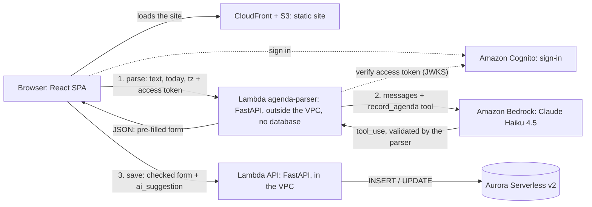

# Containers (C4 level 2): Paste an agenda

```mermaid
flowchart LR
  browser["Browser: React SPA"]
  cf["CloudFront + S3: static site"]
  cognito["Amazon Cognito: sign-in"]
  parser["Lambda agenda-parser: FastAPI, outside the VPC, no database"]
  bedrock["Amazon Bedrock: Claude Haiku 4.5"]
  api["Lambda API: FastAPI, in the VPC"]
  aurora[("Aurora Serverless v2")]

  browser -->|loads the site| cf
  browser -.->|sign in| cognito
  browser -->|"1. parse: text, today, tz + access token"| parser
  parser -->|"2. messages + record_agenda tool"| bedrock
  bedrock -->|"tool_use, validated by the parser"| parser
  parser -->|"JSON: pre-filled form"| browser
  parser -.->|"verify access token (JWKS)"| cognito
  browser -->|"3. save: checked form + ai_suggestion"| api
  api -->|"INSERT / UPDATE"| aurora
```

The model never writes. Saving goes through the existing API with its validation.
